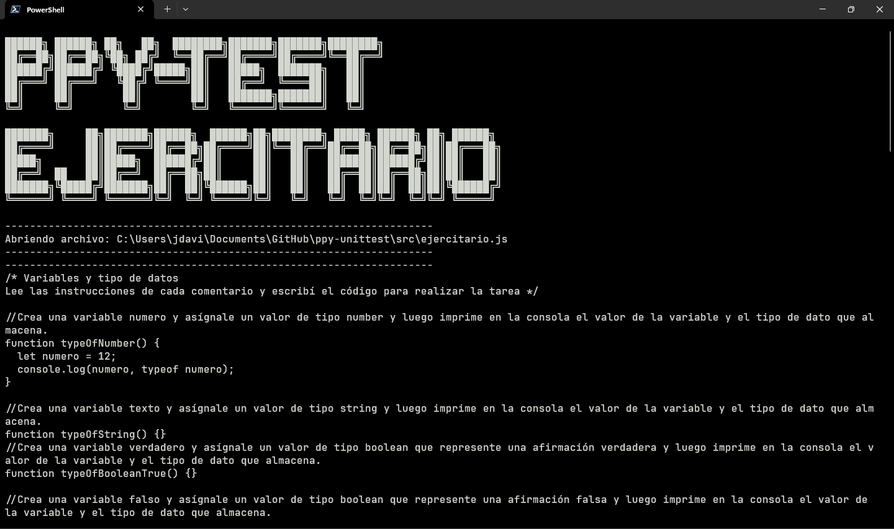
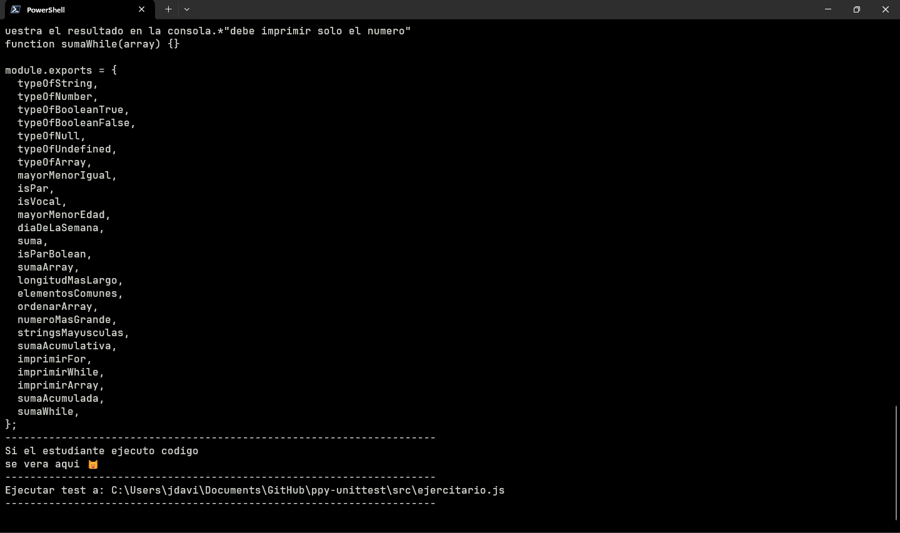
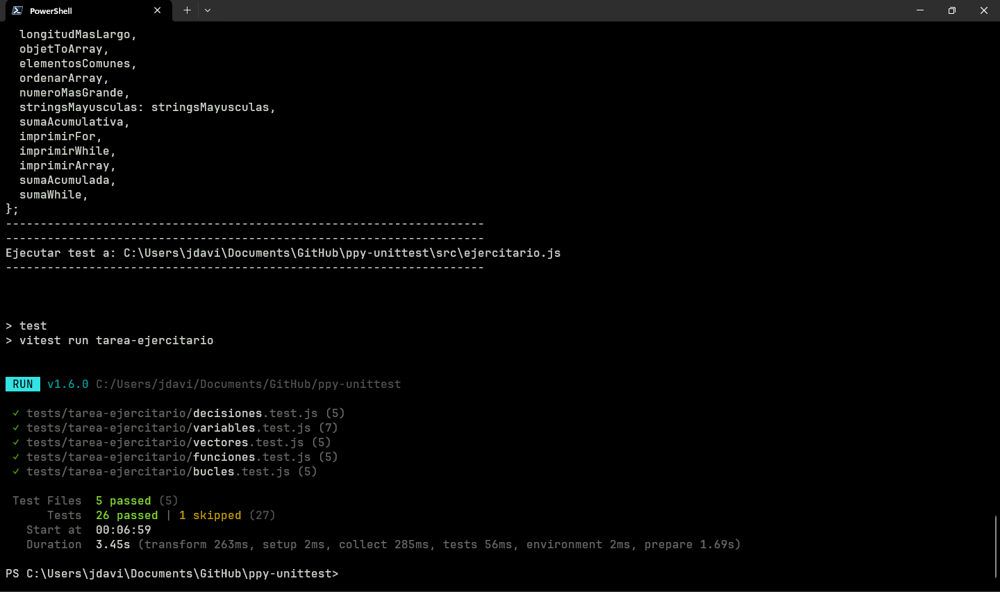
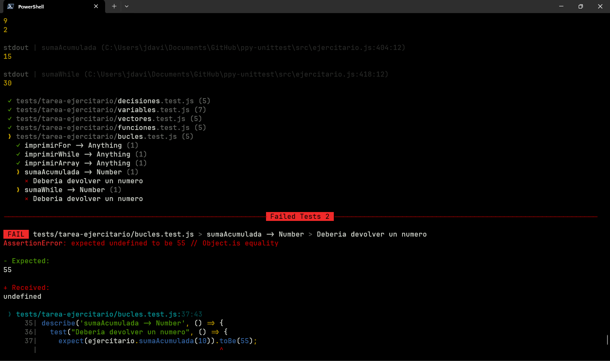
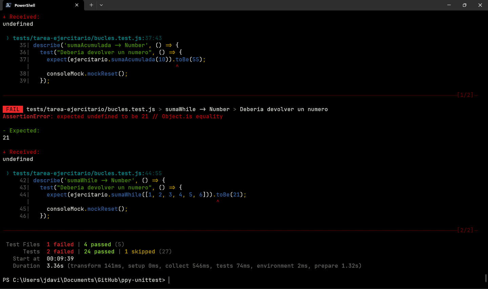
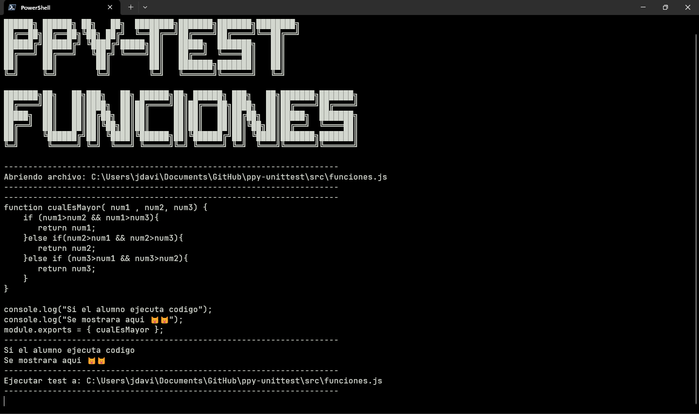
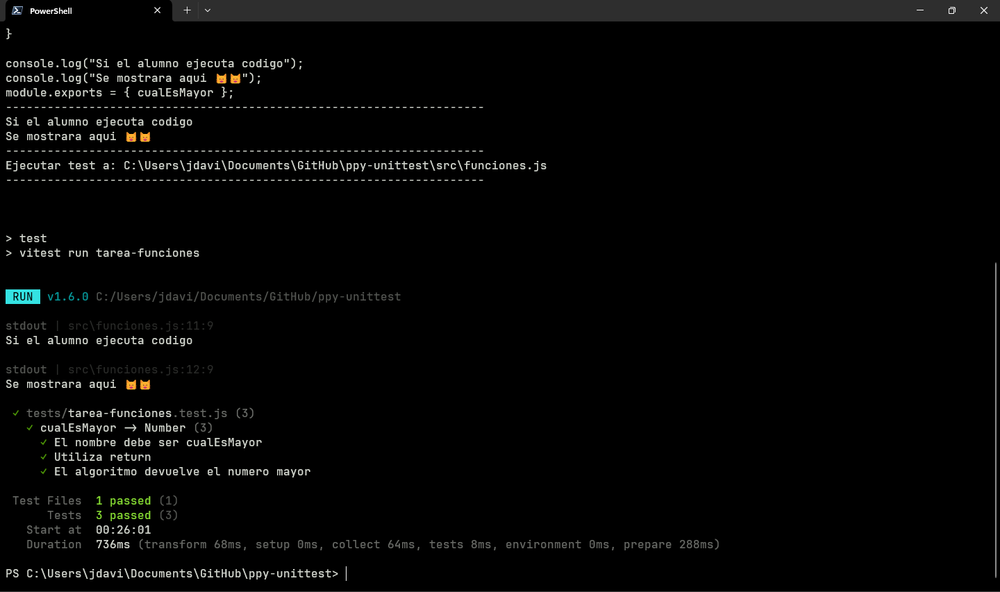
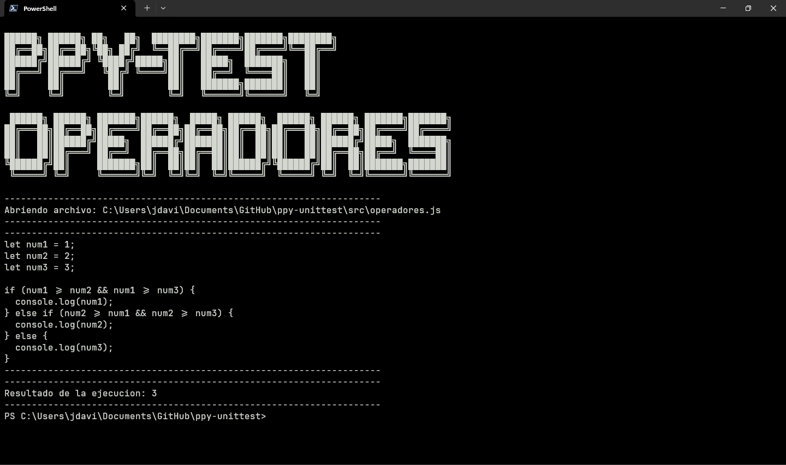

# PPY-UNITTEST

## Description
This project aims to reduce the amount of time expended while testing the
students assignments.
It provides automated testing using vitest to facilitate the time tutors
expend reading code.

## Table of contents
* [General Info](#general-info)
* [Screenshots](#screenshots)
* [Installation](#installation)
* [Usage](#usage)
* [Contributing](#contributing)
* [Technologies](#technologies)
* [Code Examples](#code-examples)
* [Status](#status)
* [Inspiration](#inspiration)
* [License](#license)
* [Contact](#contact)

## General info
The project started when me and my colleague noticed that the most time
consuming part would be checking the JS assignments, so i suggested to
make use of a testing framework called vitest to make testing suites and
reduce the time spend in downloading the file, open it in vscode check if
it runs and then mark in the form the student grade.

## Screenshots
### Ejercitario





### Funciones


### Operadores


## Installation
To get started with the project, follow these steps:

1. Powershell 7: (msi package recommended)
```
https://learn.microsoft.com/es-es/powershell/scripting/install/installing-powershell-on-windows?view=powershell-7.4#installing-the-msi-package
```
2. Nodejs v20.15.0 LTS: (pre-built binaries recommended)
```
https://nodejs.org/en/download/prebuilt-binaries
```
3. Clone the repository: 
```
git clone https://github.com/Mbarakaj4/ppy-unittest
```
4. Install dependencies:
```
npm install
```

## Usage
**Step 1** - *Go to moodle assignment page*

**Step 2** - *Go to the javascript assignment section and select one*

**Step 3** - *Click view all submissions*

**Step 4** - *Select a student*

**Step 5** - *Download the submission*

**Step 6** - *In windows terminal (Powershell 7): \
    open the folder where you cloned this repo*

**Step 7** - *Type the name of the script you that need*


It should be pretty straight forward, the tab key will autocomplete the script you need if you press it multiple times.
**FUNCIONES AND EJERCITARIO TESTS WONT CONTINUE IF YOU DON'T PRESS ENTER** so if looks like it frozed try that first.

## Contributing
Contributions from the community are welcome. To contribute to 
the project, follow these guidelines:

Fork the repository.
1. Create a new branch: git checkout -b new-feature
2. Make your changes and commit them: git commit -m 'Add 
new feature'
3. Push to the branch: git push origin new-feature
4. Submit a pull request.

## Technologies
* Vitest - version 1.6.0
* Nodejs - version 20.15.0

## Code Examples
- If you want to check the operadores assignment
```
PS C:> .\corregir-operadores-ps1
```
- If you want to check the funciones assignment
```
PS C:> .\corregir-funciones-ps1
```
- If you want to check the ejercitario assignment
```
PS C:> .\corregir-ejercitario-ps1
```

## Status
Project is:  _finished_, but I might update it if something goes wrong or if there are any issues. However, it won’t be my top priority.

## Inspiration
Project inspired in https://github.com/alex2rive3/test_ppy

## License
This project is licensed under the GNU GPLv3. Refer to the 
LICENSE file for more details.

## Contact
For any questions or feedback, feel free to leave an issue with the question tag.
